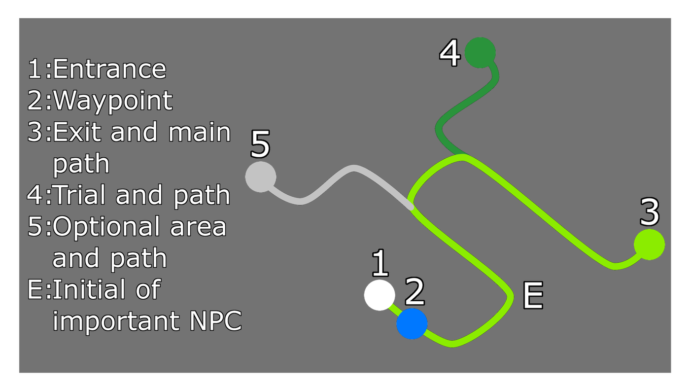

# PoE Campaign Copilot

A transparent overlay for Path of Exile 1 campaign leveling (Acts 1 to 10).
It shows the current route step, zone layout images, and build reminders.
It works passively: it reads the game's `Client.txt` log and nothing else.
No game memory, no input simulation, no network during play.

**Status: early development.** English game clients only for now.

## Install on Windows (easiest)

The easiest way to get started is to download the pre-built Windows installer.

1. Download the latest `poe-campaign-copilot-*-setup.exe` from the
   [releases page](https://github.com/andrewli8/poe-campaign-copilot/releases).
2. Run the installer. It installs per-user with no admin prompt.
3. If Windows SmartScreen warns that the app is unsigned, click **More info**
   then **Run anyway**. Code signing is future work.
4. Launch "PoE Campaign Copilot" from the Start menu.
5. Right-click the tray icon and follow the Settings steps below to configure
   your game log path.

## Run from source (developers)

This path is for developers who want to build from source. You run it from
a checkout of this repo in dev mode. That takes three tools and about ten
minutes, most of which is the first compile.

Install these once:

1. **Rust** from [rustup.rs](https://rustup.rs). Accept the default MSVC
   toolchain. If it asks for Visual Studio C++ Build Tools, let it install
   them.
2. **Node.js 20 or newer** from [nodejs.org](https://nodejs.org).
3. **Git** from [git-scm.com](https://git-scm.com) if you don't have it.

Then, in a terminal (PowerShell is fine):

    git clone https://github.com/andrewli8/poe-campaign-copilot.git
    cd poe-campaign-copilot
    npm install
    npm run tauri dev

The first build compiles a lot of Rust and can take 5 to 10 minutes. When it
finishes, a small transparent bar appears reading "Waiting for Client.txt".

Now point it at your game log:

1. Right-click the tray icon and choose **Settings**.
2. Click **Browse** and pick your `Client.txt`. Common locations:
   - Steam: `C:\Program Files (x86)\Steam\steamapps\common\Path of Exile\logs\Client.txt`
   - Standalone: `C:\Program Files (x86)\Grinding Gear Games\Path of Exile\logs\Client.txt`
3. Optionally paste a Path of Building share code (see Settings below).
4. Click **Save**.

Start Path of Exile in **windowed fullscreen** (overlays cannot draw over
exclusive fullscreen). The bar reads from the end of the log, so it stays
on "Waiting" until your first zone change. Enter any area and it comes
alive.

Useful controls: the tray menu has Setup Mode (makes the bar draggable and
resizable, in every state including the initial "Waiting" screen), Zoom
(bigger layout images, also `Alt+Shift+Z`), Compact mode (a slimmer bar,
also `Alt+Shift+C`), Hide overlay (tucks the bar away without quitting;
toggle it back from the tray or with `Alt+Shift+H`), and Quit.

### When you backtrack

If you head into a zone you already skipped, or one earlier than your
furthest point in the route, the overlay follows you there instead of
insisting you go back to where it expected. It labels what's happening with
a small chip: "Catching up" when you're working through a zone you passed
over, or "Revisiting" when you've dropped back into one you already
cleared. Underneath, a small line tells you how many zones behind your
furthest point you are, so you always know how far there is to go before
you're back on the route. None of this touches your actual progress; it
just tells you where you stand while you're off in the weeds.

One honest caveat: you are the first person to run this against the real
game. It has been developed and tested on macOS with simulated sessions,
and the Windows build compiles clean in CI, but real-game behavior
(click-through over the game window, focus handling, log line formats we
haven't seen) is exactly what needs testing now. If something looks wrong,
the terminal you launched from usually says why.

## Settings

The settings window (tray icon, then **Settings**) controls three things:

- **Client.txt log path.** Required. The overlay waits until this is set.
- **Route variant.** `league-start` is the default and assumes a fresh
  character. `standard` skips the league-start-only steps.
- **Path of Building import.** Optional. Paste a PoB share code or raw XML
  export and click **Preview import** to see the parsed class, ascendancy,
  milestone count, and a reliability badge before saving. A `structured`
  badge means the build had parseable leveling data and you'll get
  reminders like "Gem available: Frostblink" in town. An `unsupported`
  badge means the build parsed but had nothing to derive timing from; the
  route still works without it.

Save validates everything, rebuilds the route state, and persists to the
app's config directory, so settings survive restarts. Note that saving
with changes restarts route tracking from scratch.

The `POE_COPILOT_LOG` and `POE_COPILOT_LOG_REPLAY` environment variables
are developer overrides for demos. They beat the configured path but are
never written to the config file.

## Updating

From version 0.1.2 on, the app checks for a newer release each time you open
the Settings window. If one is available, a banner appears at the top of
Settings with an "Update and restart" button. Click it and the app
downloads the new version, installs it, and relaunches on its own.

The check only runs when you open Settings, never while the overlay is
tracking a session, so it does not touch the "no network during play" rule.
Every update is cryptographically signed, so the app only installs a build
that genuinely came from this project's release pipeline.

One caveat about the first install: the updater lives inside the app, so a
version that predates it (0.1.0 and 0.1.1) cannot update itself. Install
0.1.2 by hand once from the releases page, and every version after that
updates in place from the Settings window.

## Reading the layout images

When you enter a zone, the overlay's filmstrip shows one or more small
diagrams for that zone. They are not screenshots or minimaps: each is a
hand-drawn cheat-sheet sketch from the community
["Cheat sheets based on Engineering Eternity" compilation](https://docs.google.com/document/d/1sExA-AnTbroJ-HN2neZiij5G4X9u2ENlC7m_zf1tqP8/edit),
with images by
[Engineering Eternity](https://www.youtube.com/@EngineeringEternity)
(see [CREDITS.md](CREDITS.md)). Each sketch abstracts one way the zone can
spawn into a plain gray rectangle plus a suggested path, so you can match
it against your in-game map at a glance.

This is the compilation's own legend:

The drawings also use a few marks beyond the legend:

| Mark | Meaning |
| --- | --- |
| Gray rectangle | The zone's rough footprint. |
| Green dot | Where the path ends: usually the exit to the next zone, sometimes a boss or quest objective. |
| Green ring | An area circled for the notes, e.g. where quest items are grouped. |
| Gray ring | A landmark area the notes refer to, e.g. the center of Chamber of Sins. |
| Numbers or letters | Ordered stops (1, 2, 3...) or a named spawn (a "V" marks a Voll spawn in The Dried Lake). |

Zone instances are randomly generated, so the sketches show typical cases,
not exact maps. Three patterns cover most zones:

- **Fixed shapes.** Some zones always roll the same overall shape: The
  Tidal Island is always a circle, The Submerged Passage is always linear,
  most roads and forests are "follow the road/wall" linear runs.
- **Orientation tells.** Some layouts are fixed but their direction is
  revealed by a landmark. In The Submerged Passage, small totems stand on
  one side of the waypoint and the exit is always on that side. In The
  Riverways, the Wetlands entrance is always on the opposite side of the
  road from the waypoint.
- **A few known variants.** When a zone shows several images, they are the
  common spawn variants (The Dried Lake ships three, one per Voll spawn).
  Pick whichever matches what you see in game.

Two concrete examples: in The Mud Flats, the green ring marks where the
three quest glands are grouped, connected by little rivers, and the lone
gray dot is the optional Fetid Pool off the route. In The Coast, the gray
spur off the path near the waypoint is the entrance to The Tidal Island
side area.

The step text next to the images carries the matching zone notes. Both
notes and images come from an older patch and carry audit metadata (see
Content below), so treat them as strong hints rather than guarantees.

## Content

- `content/layouts/` has per-zone layout notes and diagram images for all
  10 acts, keyed by exile-leveling area id, extracted from a community
  layout compilation (see CREDITS.md). Every note and image carries audit
  metadata (`unaudited`, `verified`, `outdated`, `corrected`) so stale
  guidance is visible instead of silently wrong.
- `vendor/exile-leveling/` holds pinned route and game data (MIT), from
  [exile-leveling](https://github.com/HeartofPhos/exile-leveling).
- Layout images are by Engineering Eternity. See [CREDITS.md](CREDITS.md).
- `cargo run -p content --bin compile-content` builds the runtime content
  pack (routes, layouts, assets) into `content-pack/`.

## Development

Rust workspace plus Tauri 2. Built on macOS, validated on Windows.

    cargo test --workspace

The pilot test (`cargo test -p composer --test pilot_act1`) drives the full
pipeline from log fixture through session, engines, and composer. It is the
quickest way to see the whole system's behavior in one place.

### Live overlay demo without the game

Two terminals. The app tails a scratch log file; `fake-play` appends
fixture lines to it on a delay, so you can watch the overlay react on any
OS.

The tailer normally starts reading at the end of the file, because a real
`Client.txt` is a huge append-only history and replaying it on launch would
be slow and wrong. The demo uses a fresh empty file, so it needs
`POE_COPILOT_LOG_REPLAY=1` to read from the start.

Terminal 1:

    rm -f /tmp/fake-client.txt && touch /tmp/fake-client.txt
    POE_COPILOT_LOG=/tmp/fake-client.txt POE_COPILOT_LOG_REPLAY=1 npm run tauri dev

Terminal 2, once the bar appears:

    cargo run -p replay --bin fake-play -- crates/replay/fixtures/act1-opening.log /tmp/fake-client.txt 800

The bar walks through: Waiting, Twilight Strand, Lioneye's Watch, The Coast
(with layout images), an off-route banner on the early town revisit, then
Mud Flats. Stop the app with Ctrl-C or the tray's Quit, and delete
`/tmp/fake-client.txt` when done.

License: MIT (code). See CREDITS.md for third-party content.
